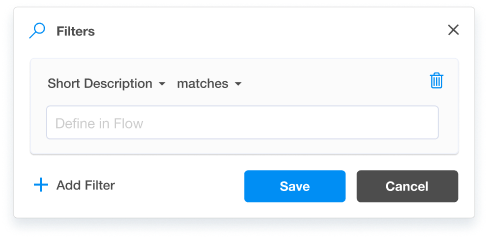

# Filter Menus

The objective is to build the UI elements using React and [Tailwind CSS](https://tailwindcss.com) of a menu component for managing different types of database filters.

<center>



</center>

### Goal #1

Match the look and feel of the top level filter menu.

- You start with an empty page with a `Manage Filters` button (provided for you in `pages/index.js`)
  - clicking this button should open an close the filter menu
- The filter menu should match the look an feel of the screenshot above. More details can be found in [Filter-menu.pdf](./Filter-menu.pdf) and [Filter-menu.png](./Filter-menu.png). Pixel-perfection is not the goal, only matching to look and feel using Tailwind CSS.
  - SVG Icons are provided for you in `./src/icons/`
  - Use a unicode `&times;` character for the "close" menu
  - The menu should contain one filter - "Short Description" + "Matches" + empty value 

### Goal #2

Come up with a strategy for delivering the following user stories and be prepared to discuss.

- As a user, I should be able to add new filters to the filter menu based on a set of available Fields (see `Filter-menu.pdf`)
- As a user, I should be able to Save current changes or Cancel to reset edits
- As a user, I should be able to remove filters
- As a user, I should see different UI depending on the type of column (string, number, tag list) is selected in the first menu

---

This is a [Next.js](https://nextjs.org/) project bootstrapped with [`create-next-app`](https://github.com/vercel/next.js/tree/canary/packages/create-next-app).

## Getting Started

First, run the development server:

```bash
npm run dev
# or
yarn dev
```

Open [http://localhost:3000](http://localhost:3000) with your browser to see the result.

You can start editing the page by modifying `pages/index.js`. The page auto-updates as you edit the file.

[API routes](https://nextjs.org/docs/api-routes/introduction) can be accessed on [http://localhost:3000/api/hello](http://localhost:3000/api/hello). This endpoint can be edited in `pages/api/hello.js`.

The `pages/api` directory is mapped to `/api/*`. Files in this directory are treated as [API routes](https://nextjs.org/docs/api-routes/introduction) instead of React pages.

## Learn More

To learn more about Next.js, take a look at the following resources:

- [Next.js Documentation](https://nextjs.org/docs) - learn about Next.js features and API.
- [Learn Next.js](https://nextjs.org/learn) - an interactive Next.js tutorial.

You can check out [the Next.js GitHub repository](https://github.com/vercel/next.js/) - your feedback and contributions are welcome!

## Deploy on Vercel

The easiest way to deploy your Next.js app is to use the [Vercel Platform](https://vercel.com/new?utm_medium=default-template&filter=next.js&utm_source=create-next-app&utm_campaign=create-next-app-readme) from the creators of Next.js.

Check out our [Next.js deployment documentation](https://nextjs.org/docs/deployment) for more details.
